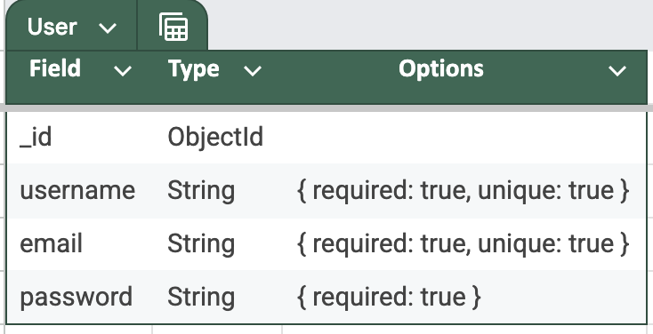
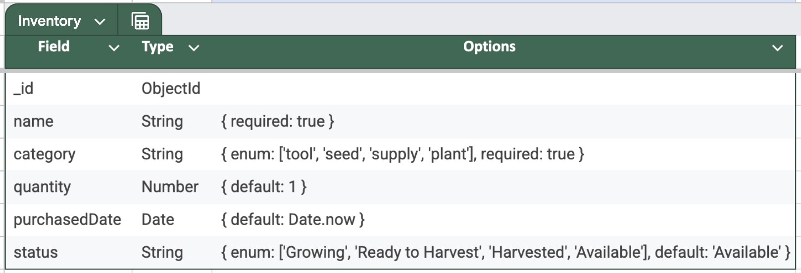

# Homestead Hero

#### An app to help track homestead inventory and gadening scheduler

## Description
Garden Manager is a web-based application designed for gardening enthusiasts who want to keep a detailed log of their plants, track watering schedules, and manage their gardening inventory. Users can easily monitor plant growth, update logs, and keep an eye on supply levels.

## Table of Contents
* [Technologies Used](#technologiesused)
* [Features](#features)
* [Design](#design)
* [ERD Images & DB Structure](#erd)
* [Project Next Steps](#nextsteps)
* [Deployed App](#deployment)
* [About the Author](#author)

## Technologies Used
* MongoDB
* Express
* React (with Vite)
* Node.jsø
* JavaScript
* CSS3

## Features
* Users can log plant details including species, planted date, and growth stage.
* Users can track the last watering date.
* An inventory system to manage gardening supplies like seeds, soil, and canned produce.
* Users can edit or delete logs and inventory items.

## Design
* Inspired by nature’s earthy tones, the UI uses a calming palette to create a user-friendly experience. CSS  and React was utilized to style the components with a clean and minimalistic look.

## ERD Images & DB Structure
* The Entity Relationship Diagram (ERD) showcasing the database structure.
  
  
  

## Project Next Steps
#### Future Features
* Implement notifications for watering and fertilizing schedules.
* Add weather API integration to provide gardening tips based on current conditions.
* Introduce a community feature where users can share their gardening progress.
* Add export functionality to download garden logs as PDFs.
* Enhance UI/UX with more interactive elements.
* Add columns based off of user feedback.

## Deployed Link
[Live Application](https://homesteadhero.onrender.com)

* View the GitHub repository for the back-end:
  [GitHub Repository](https://github.com/nc579009/CapstoneBE)
* If unable to view online, run locally through VS Code.

## About The Author
I am passionate about leveraging technology to simplify everyday tasks. This project reflects my interest in gardening and software development, combining both to help individuals keep their gardens thriving.

[Developer LinkedIn](www.linkedin.com/in/naomi-c-3549ab13a)

## Special Mention: Supporters of the Build
* User(s)

